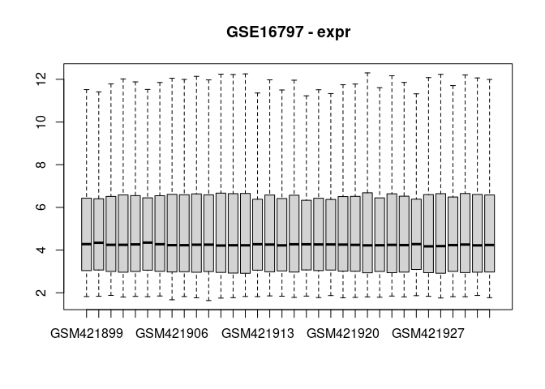

<!-- README.md is generated from README.Rmd. Please edit that file -->

# simpleExpressionProcessing

<!-- badges: start -->
<!-- badges: end -->

The goal of simpleExpressionProcessing is to provide simple tools for
downloading and normalizing raw RNA expression data from GEO, including
microarray and bulk RNA sequencing experiments, within the `GEOquery`
class format.

## Contents

- [IMPORTANT NOTE](#important-note)
- [Installation](#installation)
- [Example usage](#example-usage)
  - [Stepwise approach](#stepwise-approach)
    - [Microarray workflow](#microarray-workflow)
    - [RNAseq workflow](#rnaseq-workflow)

## IMPORTANT NOTE

- This is meant to be used for single-dataset `MetaIntegrator` objects
- To fit into a `MetaIntegrator` workflow, datasets should be processed
  individually, then combined into a multi-dataset object prior to
  `MetaIntegrator` analysis

## Installation

You can install the development version of simpleExpressionProcessing
from [GitHub](https://github.com/) with:

``` r
devtools::install_github("BenSolomon/simpleExpressionProcessing")
```

## Example usage

### Stepwise approach

This workflow involves the following steps:

- GEO data is downloaded with `MetaIntegrator`. This includes an `expr`
  slot which contains the expression data, as normalized by the data
  authors
- Supplemental data files are downloaded with `GEOquery`, such as raw
  `.CEL` files from the Affymetrix microarray platform
- The raw expression files are normalized
- The GEO data object is modified in the following ways:
  - The original `expr` slot is reassigned to the `exprGEO` slot, to
    indicate it represents the authors’ normalized data
  - The raw, non-normalized data from the supplemental files are
    assigned to the `exprRAW` slot
  - The user normalized data is added to the `expr` slot, which is the
    slot used by downstream applications using MetaIntegrator GEO
    objects
- All expression slots (i.e. `expr`, `exprRAW`, and `exprGEO`) are
  visualized with boxplots to evaluate the normalization process

### Microarray workflow

``` r
devtools::load_all() # Only needed in package development environment
#> ℹ Loading simpleExpressionProcessing
#> Warning: replacing previous import 'S4Arrays::makeNindexFromArrayViewport' by
#> 'DelayedArray::makeNindexFromArrayViewport' when loading 'SummarizedExperiment'
#> Setting options('download.file.method.GEOquery'='auto')
#> Setting options('GEOquery.inmemory.gpl'=FALSE)
accession <- "GSE16797"

# Get GEO data
gse <- MetaIntegrator::getGEOData(accession)
#> Found 1 file(s)
#> GSE16797_series_matrix.txt.gz
#>          Length Class  Mode
#> GSE16797 1      -none- list
#> [1] "GSE16797_series_matrix.txt.gz"

# Get GEO supplemental data, including raw data, and process
## withr used to create a tempdir for supplemental files for purpose of demo
withr::with_tempdir({
  getSuppFiles(accession)
  reprocess_output <- processAffy(sprintf("./%s", accession))
  
  # # Alternatively, can use `processAgilent` for Agilent platform
  # reprocess_output <- processAgilent(sprintf("./%s", accession)) 
  
})
#> Warning: replacing previous import 'AnnotationDbi::tail' by 'utils::tail' when
#> loading 'hgu133plus2cdf'
#> Warning: replacing previous import 'AnnotationDbi::head' by 'utils::head' when
#> loading 'hgu133plus2cdf'
#> 
#> Background correcting
#> Normalizing
#> Calculating Expression

# Add raw and reprocessed expression matrices to original MetaIntegrator
# GEO object
gse <- addRawExprMatrix(gse, reprocess_output$raw_expression)
gse <- addReprocessedExprMatrix(gse, reprocess_output$normalized_expression)

# Visualize effect of processing
geoAllBoxplots(gse)
```



### RNAseq workflow

``` r
devtools::load_all() # Only needed in package development environment
#> ℹ Loading simpleExpressionProcessing
accession <- "GSE158395"

# Get GEO data
gse <- MetaIntegrator::getGEOData(accession)
#> Found 1 file(s)
#> GSE158395_series_matrix.txt.gz
#>           Length Class  Mode
#> GSE158395 1      -none- list
#> [1] "GSE158395_series_matrix.txt.gz"
# Need to fix some attributes of MetaIntegrator object for RNAseq compatibility
gse <- fixMetaIntegratorForRNAseq(gse) 

# Get GEO supplemental data, including raw data, and process
## withr used to create a tempdir for supplemental files for purpose of demo
withr::with_tempdir({
  getRNAcountMatrixNCBI(accession)
  reprocess_output <- processRNA(sprintf("./%s", accession))
  
  # # Alternatively, can use `processAgilent` for Agilent platform
  # reprocess_output <- processAgilent(sprintf("./%s", accession)) 
  
})

# Add raw and reprocessed expression matrices to original MetaIntegrator
# GEO object
gse <- addRawExprMatrix(gse, reprocess_output$raw_expression, mode = "rnaseq")
gse <- addReprocessedExprMatrix(gse, reprocess_output$normalized_expression, mode = "rnaseq")

# Visualize effect of processing
geoAllBoxplots(gse)
```


